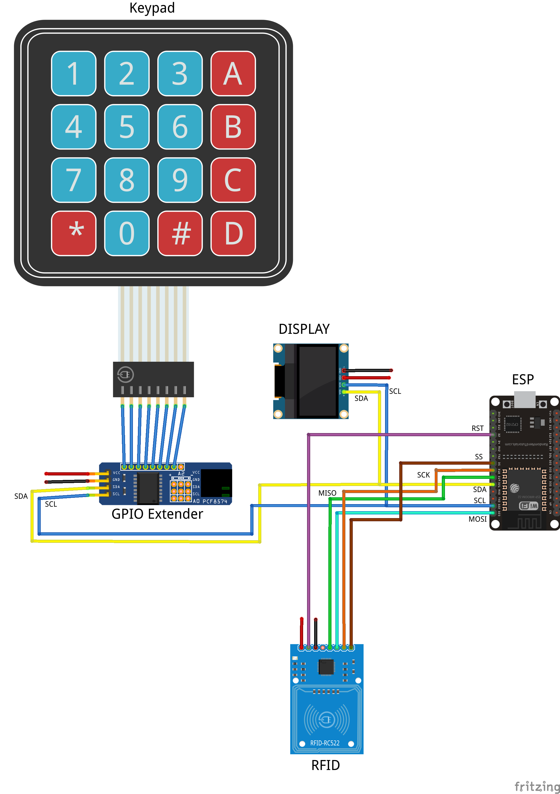

# Smart Attendance System
By Elina Levi and Arad Reder
  
## Project Description
This Smart Attendance System (or SAS) is used to monitor the comings and goings of users from a certain area.
The users can sign themselves up to the system by scanning an RFID tag and inputting a valid ID.
After signing up, a request for approval is sent to a Google Sheet doc accessible by a manager.
If the manager approves a user, the user can scan his RFID tag upon entering and / or exiting said area.
Each such scan is then logged locally on the device and sent to a different sheet in the same doc as the sign up sheet.

## Arduino/ESP32 Libraries
* robtillaart/I2CKeyPad - v0.3.3
* miguelbalboa/MFRC522 - v1.4.10
* adafruit/Adafruit SSD1306 - v2.5.7
* bblanchon/ArduinoJson - v6.21.3
 
## Folder Descriptions
* ESP32: source code for the esp side (firmware).
* GoogleAppScript: source code for the backend (Google App Script is used to handle POST requests sent from the ESP).
* Documentation: wiring diagram.
* Unit Tests: tests for individual hardware components (input / output devices).
* Parameters: contains a softlink to "consts.h", which contains all configurable parameters.

## Hardware Components
One of each of the following:
* ESP32
* OLED Display (SSD1306)
* RFID Tag Reader (MFRC522)
* 4x4 Keypad
* GPIO Extender

## Wiring Diagram

## Project Poster:

 
## About
This project is part of ICST - The Interdisciplinary Center for Smart Technologies, Taub Faculty of Computer Science, Technion
https://icst.cs.technion.ac.il/
